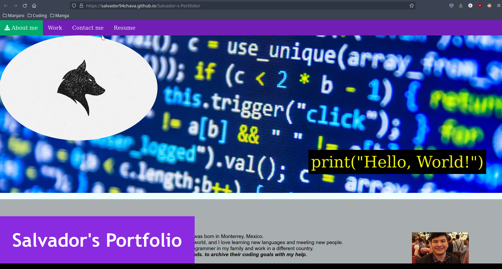

## Description

this proyect was requested by the school, to help me start my coding carrer, creating all the work from scratch.

My motivation for this proyect was to help me realize my potential in coding and to start my own page.

The main points for my page were.

*Easy to navigate.
*links able to work.
*have a page that links the user to all my social media.
*have the user able to jump into my CV with a small click but not making him leave the page.

##Table of Contents.
In the following spaces I will have links to make it easier for the reader. to find what it wants instead of reading everysingle paragraph to find what they want.

-[Installation](#Installation)

-[Credits](#Credits)

-[License](#License)

-[Links](#Links)

-[Bugs](#Bugs)

## Installation
To run this web-page we only need to go to GitHub to https://github.com/Salvador94Chava/Salvador-s-Portfolio and click on clone code or to simply go to pages and click on the link. and go to the webpage and we can check the web-page from there.

here are screenshots from the GitHub account

also here is a picture of the webpage running on Github-pages

## Credits
there are no extra collaborations in this portfolio.

## License
I give permision for anybody to see my code and to replicate if they wish to do so.

## Links

here are the links ot the websites of Github here the person reading will be able to locate my work on the repository.

[Github-Salvador94Chava](https://github.com/Salvador94Chava)

## Bugs
there are still bugs on the repo, I was unable to fix when the website is visited or seen in a different, device besides a laptop. the person will have difficulties reading or understanding the page in General.

still not able to make the page work on another screens I will have to make a coderefactor.

I will keep updating this file on the future.

This page was updated on 13/1/2022 (Day/Month/Year)