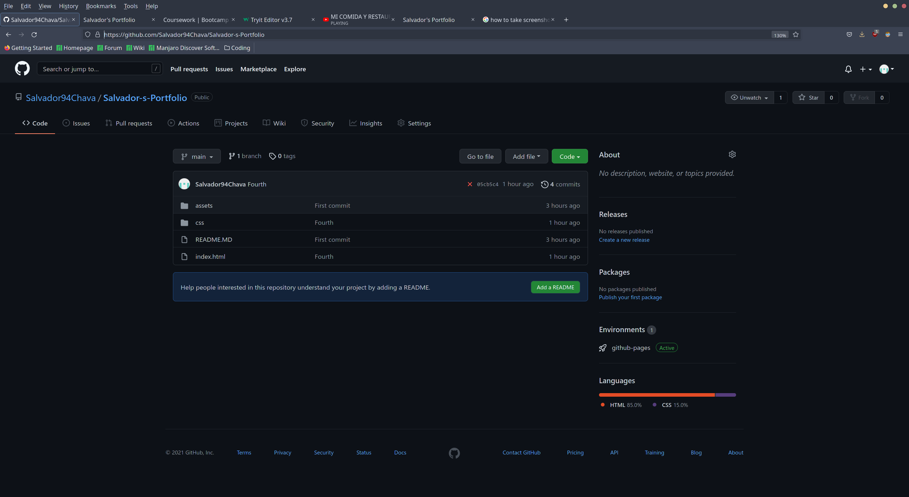

## Description

this proyect was requested by the school, to help me start my coding carrer, creating all the work from scratch.

My motivation for this proyect was to help me realize my potential in coding and to start my own page.

The main points for my page were.

*Easy to navigate.
*links able to work.
*have a page that links the user to all my social media.
*have the user able to jump into my CV with a small click but not making him leave the page.

##Table of Contents.
In the following spaces I will have links to make it easier for the reader. to find what it wants instead of reading everysingle paragraph to find what they want.

-[Installation](#Installation)

-[Credits](#Credits)

-[License](#License)

-[Links](#Links)

-[Bugs](#Bugs)

# Installation
To run this web-page we only need to go to GitHub to https://github.com/Salvador94Chava/Salvador-s-Portfolio and click on clone code or to simply go to pages and click on the link. and go to the webpage and we can check the web-page from there.

here are screenshots from the GitHub account

also here is a picture of the webpage running on Github-pages

![screenshot webpage Github-pages]

# Credits
# License
# Links
# Bugs